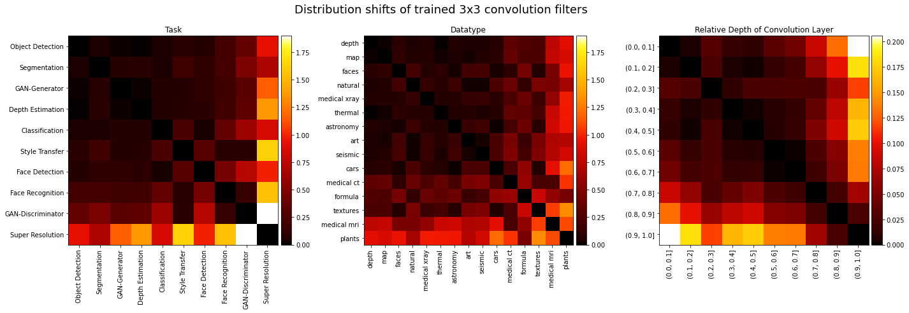

# CNN-Filter-DB

**An Empirical Investigation of Model-to-Model Distribution Shifts in Trained Convolutional Filters**<br>
Paul Gavrikov, Janis Keuper



Paper: <not yet available>

Abstract: *We present first empirical results from our ongoing investigation of distribution shifts in image data used for various computer vision tasks. Instead of analyzing the original training and test data, we propose to study shifts in the learned weights of trained models. In this work, we focus on the properties of the distributions of dominantly used 3x3 convolution filter kernels. We collected and publicly provide a data set with over half a billion filters from hundreds of trained CNNs, using a wide range of data sets, architectures, and vision tasks. Our analysis shows interesting distribution shifts (or the lack thereof) between trained filters along different axes of meta-parameters, like data type, task, architecture, or layer depth. We argue, that the observed properties are a valuable source for further investigation into a better understanding of the impact of shifts in the input data to the generalization abilities of CNN models and novel methods for more robust transfer-learning in this domain.*

## Versions 
  
| Number | Changes |
|:---:|:---|
| v1.0 | Initial dataset as presented in the NeurIPS 2021 DistShift Workshop|

## Environment 
We have executed this with `Python 3.8.8` on `Linux 3.10.0-1160.24.1.el7.x86_64`. The scripts should however work with most python3 versions and OS.

To install all necessary modules please run:
```
pip install -r requirements.txt
```

or install these modules manually with your desired package manager:
```
numpy==1.21.2
scipy
scikit-learn==0.24.1
matplotlib==3.4.1
pandas==1.1.4
fast-histogram==0.10
KDEpy==1.1.0
tqdm==4.53.0
colorcet==2.0.6
h5py==3.1.0
```


## Prepare 
Download `dataset.h5` from https://bit.ly/2Zc4xry. This file contains the filters and meta information as individual datasets. 
 
The filters are linked as a `Nx9` `numpy.float32` array under the `/filter` dataset. Every row is one filter and the row number is also the filter ID (i.e. the first row is filter ID 0). To reshape a filter `f` back to their original shape use `f.reshape(3, 3)`.
  
The meta information is stored as a `pandas.DataFrame` under `/meta`. Following is an *out of order* list of column keys with a short description. Other column keys can and should be ignored. The table has a Multiindex on `[model_id, conv_depth, conv_depth]`.
  
| Column                                                                                                                                                                                                                                                                                                                                                                                                                                                                                                                                                                                                         | Description   |
|:---------------------------------------------------------------------------------------------------------------------------------------------------------------------------------------------------------------------------------------------------------------------------------------------------------------------------------------------------------------------------------------------------------------------------------------------------------------------------------------------------------------------------------------------------------------------------------------------------------------|:--------------|
| model_id                                                                                                                                                                                                                                                                                                                                                                                                                                                                                                                                                                                                       | Unique int ID of the model. |
| conv_depth                                                                                                                                                                                                                                                                                                                                                                                                                                                                                                                                                                                                     | Convolution depth of the extracted filter i.e. how many convolution layers were hierarchically below the layer this filter was extracted from.  |
| conv_depth_norm                                                                                                                                                                                                                                                                                                                                                                                                                                                                                                                                                                                                | Similar to `conv_depth` but normalized by the maximum `conv_depth`. Will be a flaot betwenn 0 (first layers) .. 1 (towards head). |
| filter_ids                                                                                                                                                                                                                                                                                                                                                                                                                                                                                                                                                                                                     | List of Filter IDs that belong to this record. These can directly be mapped to the rows of the filter array. |
| model                                                                                                                                                                                                                                                                                                                                                                                                                                                                                                                                                                                                          | Unique string ID of the model. Typically, but not reliably in the format {name}_{trainingset}_{onnx opset}. |
| producer                                                                                                                                                                                                                                                                                                                                                                                                                                                                                                                                                                                                       | Producer of the ONNX export. Typically various versions of PyTorch. |
| op_set                                                                                                                                                                                                                                                                                                                                                                                                                                                                                                                                                                                                         | Version of the ONNX operator set used for export. |
| depth                                                                                                                                                                                                                                                                                                                                                                                                                                                                                                                                                                                                          | Total hierarchical depth of the model including all layers. |
| Name                                                                                                                                                                                                                                                                                                                                                                                                                                                                                                                                                                                                           | Name of the model. Not necessarily unique. |
| Paper                                                                                                                                                       |  Link to the Paper. Not always populated. |  
| Pretraining-Dataset                                                                                                                                                                                                                                                                                                                                                                                                                                                                                                                                                                                            | Name of the pretraining dataset(s) if pretrained. Multiple datr sets are seperated by commas. |
| Training-Dataset                                                                                                                                                                                                                                                                                                                                                                                                                                                                                                                                                                                               | Name of the training dataset(s). Multiple datr sets are seperated by commas.|
| Datatype                                                                                                                                                                                                                                                                                                                                                                                                                                                                                                                                                                                                       | Visual, manual categorization of the training datatsets. |
| Task                                                                                                                                                                                                                                                                                                                                                                                                                                                                                                                                                                                                           | Task of the model. |
| Accessible                                                                                                                                                                                                                                                                                                                                                                                                                                                                                                                                                                                                     | Represents where the model can be found. Typically this is a link to GitHub.  |
| Dataset URL                                                                                                                                                                                                                                                                                                                                                                                                                                                                                                                                                                                                    | URL of the training dataset. Usually only entered for exotic datasets. |
| total_filters                                                                                                                                                                                                                                                                                                                                                                                                                                                                                                                                                                                                  | Total number of convolution filters in this model. |
| 3x3_filter_share                                                                                                                                                                                                                                                                                                                                                                                                                                                                                                                                                                                               | The share of 3x3 filters compared to all other conv filters. |
| (X, Y) filters                                                                                                                                                                                                                                                                                                                                                                                                                                                                                                                                                                                                 | Represents how often filters of shape `(X, Y)` were found in the source model. |
| Conv, Add, Relu, MaxPool, Reshape, MatMul, Transpose, BatchNormalization, Concat, Shape, Gather, Softmax, Slice, Unsqueeze, Mul, Exp, Sub, Div, Pad, InstanceNormalization, Upsample, Cast, Floor, Clip, ReduceMean, LeakyRelu, ConvTranspose, Tanh, GlobalAveragePool, Gemm, ConstantOfShape, Flatten, Squeeze, Less, Loop, Split, Min, Tile, Sigmoid, NonMaxSuppression, TopK, ReduceMin, AveragePool, Dropout, Where, Equal, Expand, Pow, Sqrt, Erf, Neg, Resize, LRN, LogSoftmax, Identity, Ceil, Round, Elu, Log, Range, GatherElements, ScatterND, RandomNormalLike, PRelu, Sum, ReduceSum, NonZero, Not | Represents how often this ONNX operator was found in the original model. Please note that individual operators may have been fused in later ONNX opsets. |


## Run
Adjust `dataset_path` in https://github.com/paulgavrikov/CNN-Filter-DB/blob/main/main.ipynb and run the cells.

## Citation 

If you find our work useful in your research, please consider citing:

```
<not yet available>
```
